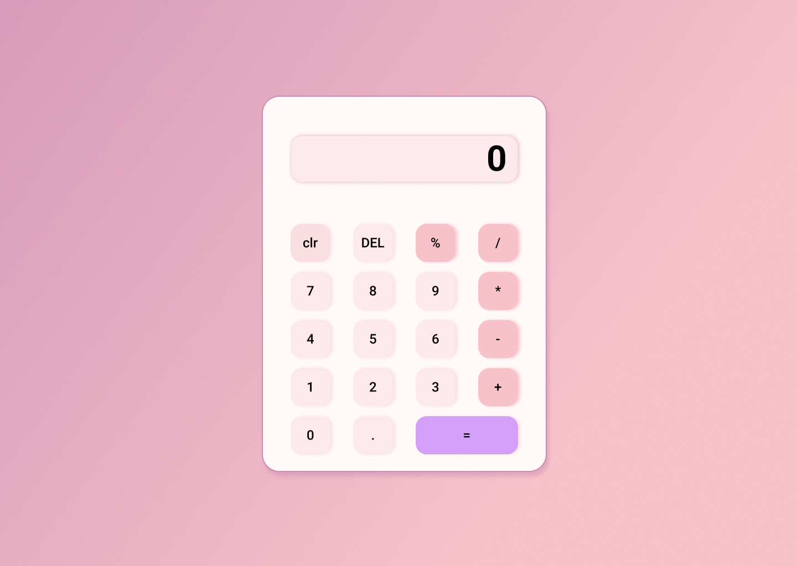

# 🧮 Pink Calculator

A simple and elegant calculator built with HTML, CSS, and JavaScript as part of my **CodeAlpha Frontend Development Internship**.

---

## 📸 Preview



---

## ✨ Features

- Basic arithmetic operations: Addition, Subtraction, Multiplication, Division
- Percentage calculation
- Delete last character (DEL)
- Clear all input (C)
- Responsive design — works on mobile and desktop
- ⌨️ Keyboard support (type numbers and press Enter to calculate)

---

## 🛠️ Built With

- HTML5
- CSS3 (Grid, Flexbox, Gradients)
- JavaScript (Vanilla)

---

## 🚀 How to Run

1. Clone this repository:
   
   git clone https://github.com/YOUR_USERNAME/CodeAlpha_Calculator.git

2. Open the project folder
3. Open `index.html` in your browser

That's it — no installations needed!

---

## 📁 Project Structure

```
CodeAlpha_Calculator/
│
├── index.html      # Calculator structure
├── style.css       # Pink theme & layout
├── script.js       # Calculator logic
└── README.md       # Project documentation
```

---

## 👩‍💻 Author

**Ouakli imene**  
Frontend Development Intern @ CodeAlpha  
[LinkedIn](www.linkedin.com/in/imeneouakli) 
